<!-- This README will need to contain a description of your project, how to run it, how to set up the development environment, and who worked on it.
This information can be added throughout the course, except for the names of the group members.
Add your own name (do not add the names for others!) to the section below. -->

# SEM Group 33A - Rowing scenario

## Description of project
We are going to develop a microservice architecture in a team of six, taking into account the Software Engineering techniques that were thaught during
Software Engineering Methods (SEM) course 2022/2023.

The real-life scenario we were assigned to is "Rowing", as associations in and surrounding Delft have decided it should be easier to find a team to train and compete with.   
Thus, we are expected to  develop an application that will match available people to trainings and competitions that still require extra people.

## Group members

| Profile Picture                                                                            | Name               | Email                                           |
|--------------------------------------------------------------------------------------------|--------------------|-------------------------------------------------|
|  | Dawid Plona        | d.k.plona@student.tudelft.nl |
|  | Laimonas Lipinskas | l.lipinskas@student.tudelft.nl                 |
|  | Lotte Kremer       | l.a.a.kremer@student.tudelft.nl             |
|  | Vlad Nitu          | v.p.nitu@student.tudelft.nl                     |
|  | Radu Nicolae       | r.Nicolae@student.tudelft.nl                   |
|  | Razvan Loghin      | r.loghin@student.tudelft.nl                    |

## How to set up the system
- Prerequisites:
    - Java 11
    - Gradle installed locally (run 'Gradle -version' in terminal. If the command appears as "not found", then you need to install Gradle)
    - The system will be built with Spring framework and Gradle

- Run `gradle <microservice_package_name> :bootRun` in order to start a specific microservice.
- We provide 5 subsystems, which are placed in the following packages
    - `authentication-microservice` - Authentication,hosted on `localhost:8081`
    - `activity-microservice` - Activity, hosted on `localhost:8084`
    - `micro` - Matching, hosted on `localhost:8083`
    - `notification-microservice` - Notification, hosted on `localhost:8086`
    - `user` - User, hosted on `localhost:8085`

## How to use the system

### **Important notes**:
- The user is always authorized before making a request, such that he does not have the possiblity to behave malicious.
  Thus, each `userId` is inherited from the userId that he registered and authenticated with. If he tries to impersonate another user,
  a _**bad request**_ would be thrown in response

1. Assuming that you are the user of the system, you will firstly have to register a new account. You will be asket to provide
   your unique `userId` and a `password` that would be encrypted and safely stored in our system (implemented using Spring Security).
     POST - `localhost:8081/register/`
2. Using the account you registered, you can authenticate using the same credentials.
     POST - `localhost:8081/authenticate/`
     After doing so, you will receive in the response body the Bearer Authentication token that you need to manually add in order
   to authorize for further requests.
    
   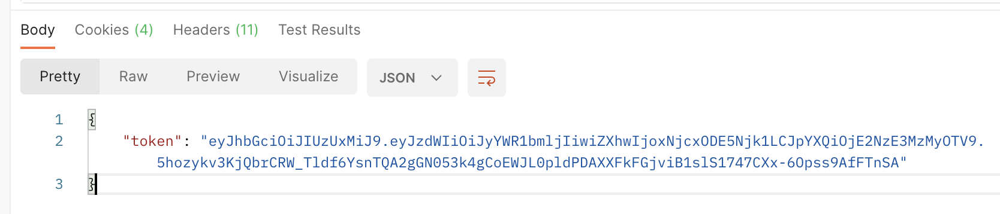
3. After authenticating, you still need to personalize your user account by using the following API endpoint:
     POST - `localhost:8085/createUser`
     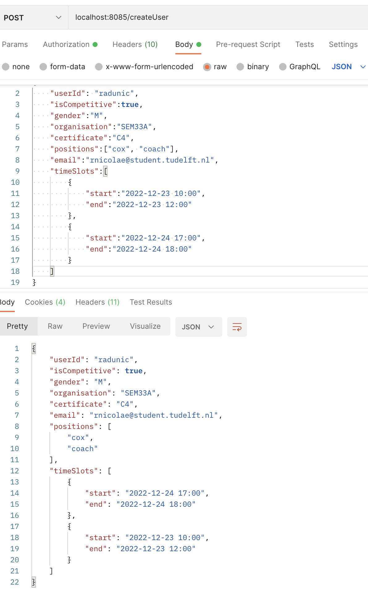
4. If you want to create a new activity, you need to specify the attributes of this activity in the following way:
     POST - `localhost:8084/createActivtiy/{activityType}`
     where activityType should be either a "training", or a "competition"
     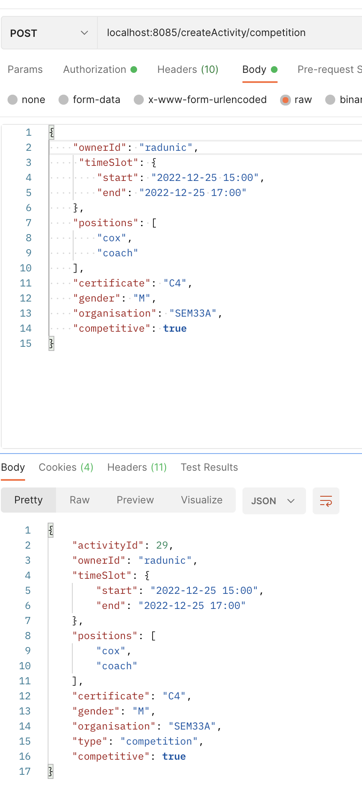
5. If you want to get all the activities that are possible matches to your availability:
     GET - `localhost:8085/getAvailableActivities`
     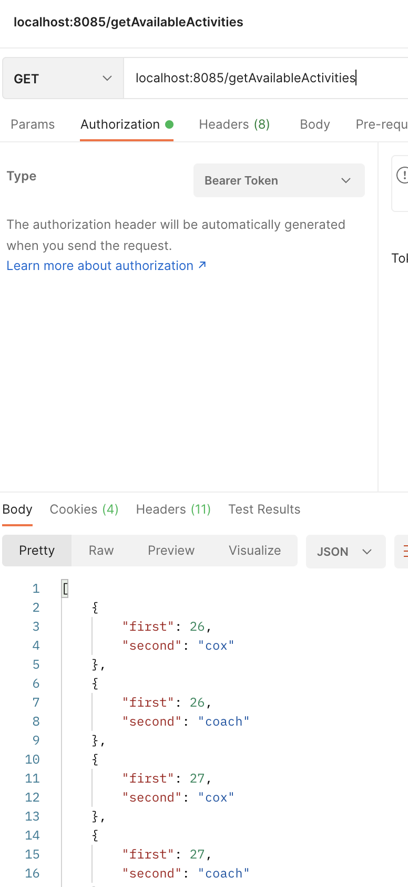
6. After checking all the available activities, if you want to participate in one of them, you have to call:
     POST - `localhost:8085/chooseActivity`
     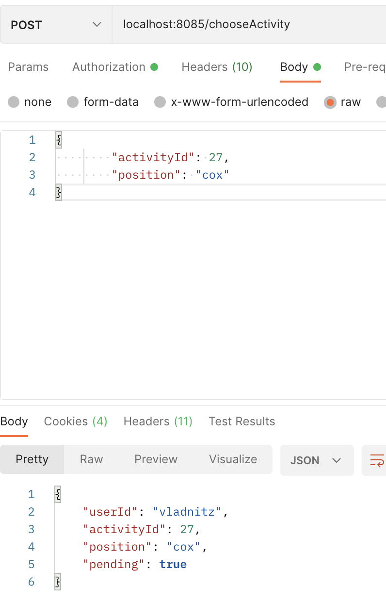  
   When the **Email Strategy** is set as primary, then we are going to receive an e-mail of the following format:
     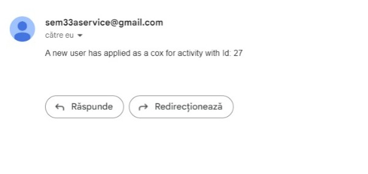 This way, the notification is not going to be persisted in the database.
7. As an owner, you will have to accept or decline other users' requests to take part in your activity. For that you will use:
     POST - `localhost:8085/decideMatch/{type}`, where `type` can take the following values: `accept` or `decline`
   For example, if the owner `radunic` decides to accept the user `vladnitz` by using the following API:
     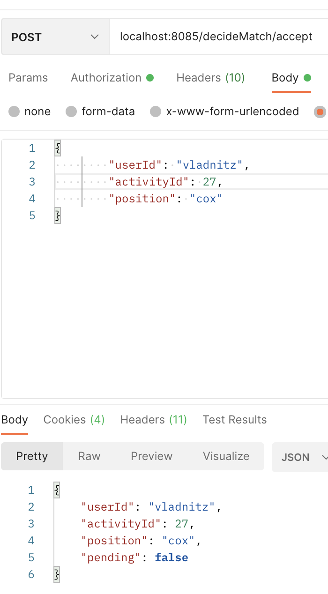, then `vladnitz` will also receive an e-mail (if the Email strategy is used),
   saying that:
     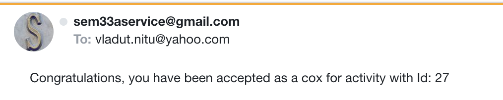
8. Moreover, the user can obtain the activities he has already matched to by calling:
     GET - `localhost:8085/getUserActivities`
     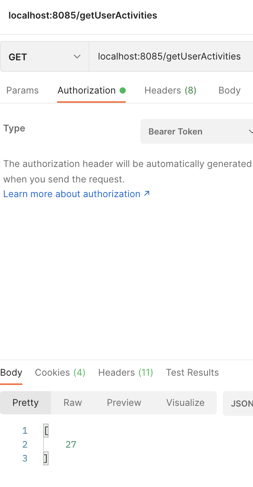 , where the response body represent a list of the `activityId`s he/she was assigned to
9. If a user decide he does not want to participate in an activity that he was matched to previously,he / she can:
     POST - `localhost:8085/unenroll`
     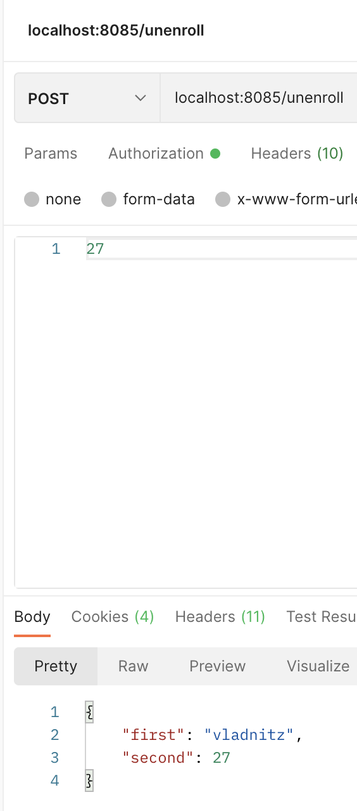, passing the activityId of the activity he wants to quit in the body of the request
   In response, he obtains `first`, which is his/her `userId`, and `second`, which is the activity's `activityId`
10. If a owner wants to cancel a activity he/she previously created, then:
      GET - `localhost:8085/cancelActivity/{activityId}`
      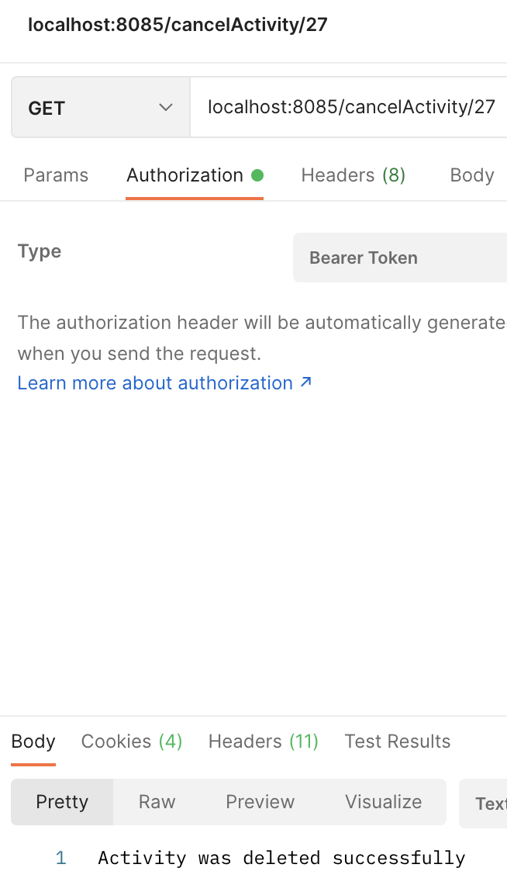
11. If a user was offline and wants to read the notifications that were sent to him by the system during this time (if the Persistence strategy is being used, as otherwise he/she would have already been notified via E-mail),
    then:
      GET - `localhost:8085/getNotifications`
      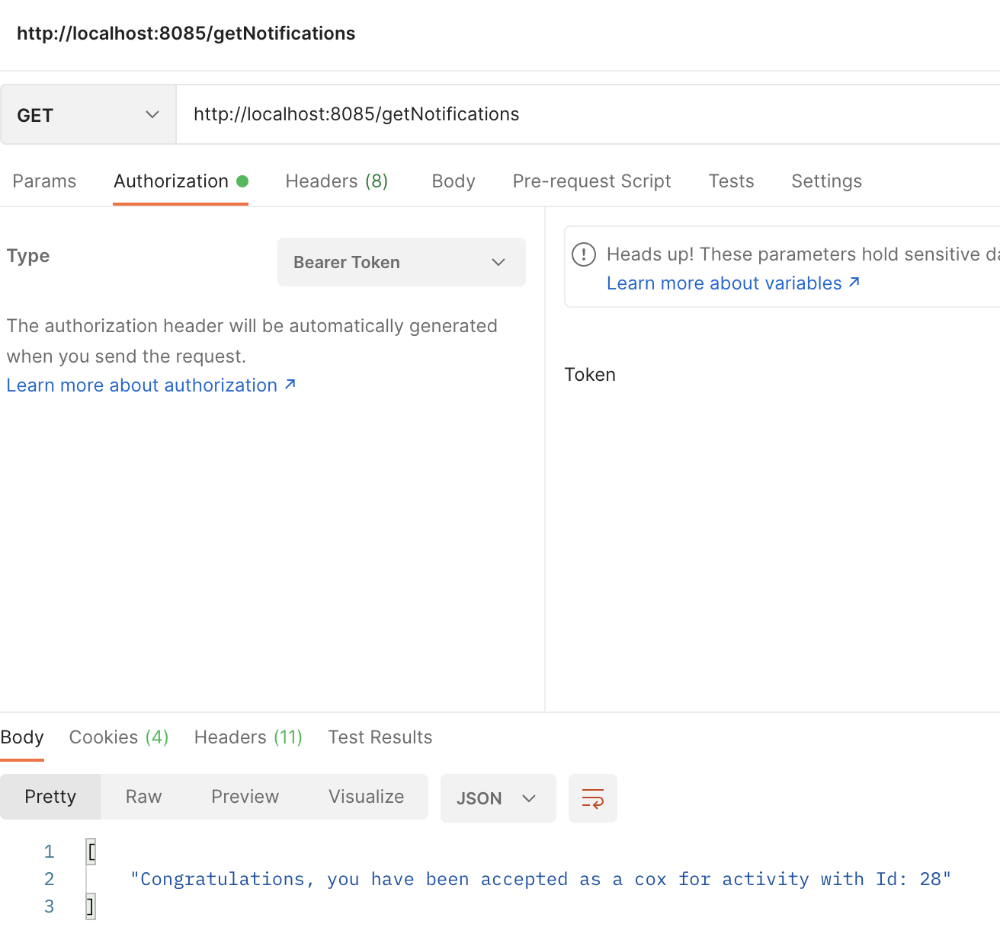
    This notifications are stored in the database until retrieval (when the user demands these notifications) .

## How to contribute to it
As there is always room for improvement, future users can contribute as following:
1. If you spot any bugs, please let us know in order to fix the product as soon as possible. Our emails can be found in the "Group members" section.
2. If you have any idea that is relevant in improving our game, we are looking forward to hearing your proposals.

## Copyright / License (opt.)

